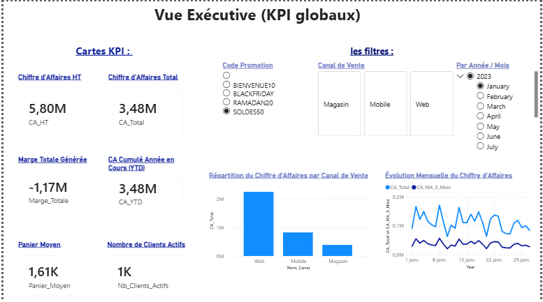
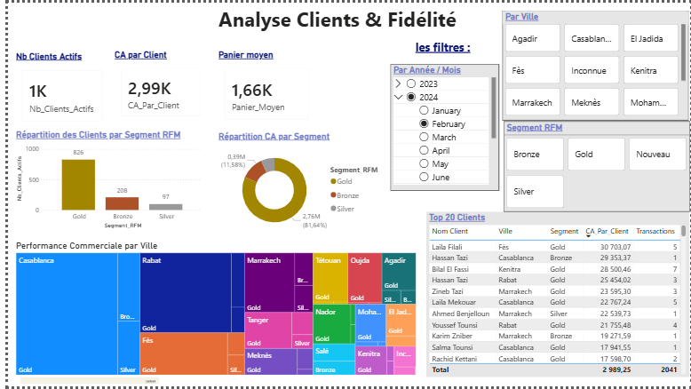

# Architecture BI Multi-Sources pour E-Commerce

Ce projet propose une solution complète de **Business Intelligence** pour analyser les performances d'une plateforme e-commerce multi-canaux (Web, Mobile et Magasins physiques). Inspirée des leaders du marché marocain comme Jumia ou Amazon, l'architecture traite l'intégralité de la chaîne décisionnelle, de la génération de données hétérogènes à la visualisation avancée dans Power BI.

## 🚀 Aperçu du Projet

L'objectif principal est de transformer des données brutes provenant de sources disparates en **insights stratégiques**. Le système permet notamment d'identifier des leviers de croissance, comme l'optimisation du tunnel de conversion (gain potentiel de 11,86M MAD) ou la réduction des retours clients.

### Points clés :

* **Intégration Multi-Sources :** Extraction de données depuis SQL, Excel, CSV, JSON et XML.
* **Modélisation Décisionnelle :** Conception d'un modèle en étoile avec 7 dimensions et 4 tables de faits.
* **Analyses Avancées :** Segmentation RFM, Analyse ABC (loi de Pareto), Time Intelligence et Funnel de conversion.
---

## 🛠️ Architecture Technique

L'architecture suit le paradigme classique des entrepôts de données:

1. **Génération (Python) :** Simulation de comportements clients réalistes avec patterns saisonniers (Ramadan, Black Friday).
2. **Stockage (MySQL) :** Base de données relationnelle hébergeant l'entrepôt.
3. **ETL (Power Query) :** Nettoyage, standardisation et gestion de la qualité des données (doublons, valeurs NULL).
4. **Visualisation (Power BI) :** Création de mesures DAX complexes et de dashboards interactifs.
---

Voici une version complète et structurée de la galerie pour votre fichier **README.md**, intégrant les noms de fichiers suggérés et les indicateurs clés (KPIs) extraits de votre rapport technique.

---

## 📸 Galerie des Dashboards

Cette section présente les cinq interfaces décisionnelles conçues pour répondre aux besoins analytiques des différentes directions de l'entreprise.

### 1. Vue Exécutive Globale

Vision stratégique de la performance globale permettant une prise de décision rapide par la direction générale.

* **Indicateurs clés :** Chiffre d'affaires HT (5,80M MAD), Marge Totale (-1,17M MAD), et Panier Moyen (1,61K MAD).
* **Analyses incluses :** Répartition du CA par canal (Web 57%, Mobile 29%, Magasin 14%) et évolution mensuelle avec moyenne mobile sur 3 mois.
<p align="center">

</p>

---

### 2. Analyse Clients & Fidélité

Exploration du comportement client pour optimiser les stratégies de marketing et de CRM.
* **Segmentation RFM :** Identification des clients **Gold** (représentant 81,64% du CA), Silver, Bronze et Nouveaux.
* **Performance Géographique :** Visualisation Treemap montrant la dominance des marchés de Casablanca et Rabat.
<p align="center">

</p>

---

### 3. Performance Produits & Stock

Optimisation du catalogue et de l'assortiment via une analyse granulaire des références.
* **Analyse ABC :** Classification des produits selon la loi de Pareto pour prioriser les réapprovisionnements (Classe A = Top 70%).
* **Matrice CA vs Marge :** Identification des produits "Stars" et "Cash Cows" pour ajuster la stratégie de pricing.
<p align="center">

</p>

---

### 4. Retours & Logistique

Suivi de la qualité de service et analyse de l'impact financier des retours produits.
* **Indice de qualité :** Suivi d'un taux de retour global de 16% et d'un indice de qualité logistique de 0,84.
* **Analyse des causes :** Identification des motifs principaux (Couleur différente, Taille incorrecte) représentant 53% du total des retours.
<p align="center">

</p>

---

### 5. Trafic Web & Conversion

Analyse du parcours client digital pour maximiser l'efficacité du tunnel de vente.
* **Tunnel de conversion :** Analyse du passage de 100K sessions à 50K achats (taux de conversion de 50%).
* **Manque à gagner :** Quantification du chiffre d'affaires potentiel perdu dû à l'abandon de panier (35,59M MAD).
<p align="center">

</p>

---
> 
> **Note :** Les données présentées sont issues d'une simulation statistique réaliste incluant des patterns saisonniers spécifiques au marché marocain (Ramadan, Black Friday).
> 
---

## ⚙️ Installation et Utilisation

### Prérequis

* Python 3.x
* MySQL Server & Driver ODBC 9.5 ANSI 
* Power BI Desktop

### Étapes

1. **Cloner le dépôt :**

```bash
git clone https://github.com/KenzaAEK/E-Commerce-Insight.git

```
2. **Générer les données :**
Exécutez le script Python pour créer les fichiers sources (CSV, JSON, XML, etc.).

```bash
pip install -r requirements.txt
python generation_donnees.py

```
3. **Charger dans MySQL :**
Utilisez le script d'upload pour créer le schéma et injecter les données.

```bash
python upload_to_sql.py

```
4. **Ouvrir Power BI :**
Ouvrez le fichier `.pbix`, configurez le DSN ODBC et actualisez les données.
---

## 👥 Équipe de projet

* **Réalisé par :** ABOU-EL KASEM Kenza & EL BAKALI Malak.
* **Encadré par :** Pr. BADIR Hassan.
* **Institution :** ENSA Tanger, Université Abdelmalek Essaâdi.
* **Année Universitaire :** 2025-2026.


---
